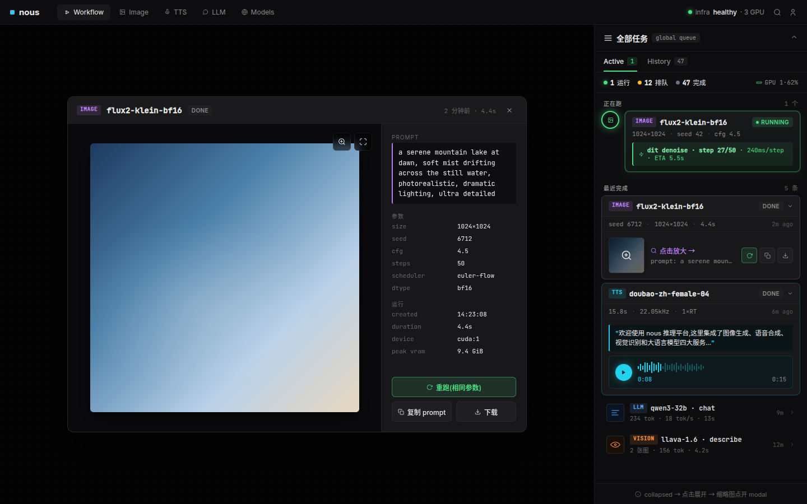

# 任务面板重置 — 全局任务队列 + 三态交互 + 渲染队列美学

> 状态:**spec 待 review**(2026-05-27,office-hours D1-D7 收敛 + 用户认可三态合成版)。
> 接 PR #156 - #171 三次浮窗迭代翻车的总结性重置。
> 依据 [[feedback-read-comfyui-source]] [[feedback-use-askuserquestion]] [[feedback-long-term-robustness]] [[feedback-pr-per-change]] [[feedback-push-before-impl]]。

## TL;DR

把 PR #156 - #171 的浮窗式 task 面板**整体废弃**,重写为:

- **右侧 dock sidebar 380px**(永久固定 · 可折到 48px,**不是浮窗 / 不是底栏 / 不是路由**)
- **全局任务队列**(跨 image / tts / vision / llm 四服务,不绑当前 workflow)
- **三态交互** collapsed → expanded → modal
- **L3 进度颗粒度** stage + step + per-step latency + ETA(超越 ComfyUI 节点级)
- **渲染队列管理器美学**(参考 Adobe AE / Houdini PDG / Thinkbox Deadline)+ service color coding

终极 mockup 真截图:



## 背景:为什么重置

PR #156(popover→drawer)→ #169(紧凑卡)→ #170/171(350px 浮窗 + 真复刻 ComfyUI Vue source)三次迭代后,用户多次反馈「太丑 / 没设计感 / 不还是老样子」。根因:

1. 直接抄 ComfyUI overlay,误以为 ComfyUI 是审美标杆,实际 ComfyUI 是「能用」级别,不是产品级
2. 把「任务面板」局限在 image workflow 内,丢失了 nous-center 跨服务(image / tts / llm / vision)的整体视角
3. 进度只到节点级,没有 stage + step + ETA 时间维度,长任务时用户「不知道卡哪了」

本次决策不再抄 ComfyUI 形态,改抄**渲染队列管理器**(AE / Houdini / Deadline)— 这是 task panel 这一类 UI 的真正成熟形态。

## 决策链(D1-D7)

走 `/office-hours` skill,7 个 decision brief 走完。

### D1 — 方向

> 用户原话:"参考一些渲染 queue 的,可以是 comfyui,但你这个 ui 太丑,而且进度管理只是卡节点"

→ 渲染队列管理器美学 + L3 进度颗粒度

### D2 — Sidebar 形态(初版)

| 选项 | 选择 |
|---|---|
| A 浮窗精修 | ❌ 用户已说「老样子」 |
| B 独立 /tasks 页 | ❌ 丢 ambient awareness |
| C Civitai gallery 优先 | ❌ 失去任务控制 |
| D 浮窗 + /history 双栈 | ⚠ 推荐,但后续 D4 修正成 dock sidebar |

### D3 — 进度颗粒度 → **L3**

| Level | 内容 | 选 |
|---|---|---|
| L2 | 只 stage 切换 | ❌ dit 50 步内黑盒 30s 不动用户怀疑挂了 |
| **L3** | stage + step n/N + per-step latency + ETA | ✅ AE/Deadline/Houdini 标准颗粒 |
| L4 | + 算子级 profiling | ❌ profiler 工具,不是 task UI 的事 |

### D4 — 物理形态 → **B 右侧 dock sidebar**

| 选项 | 选择 |
|---|---|
| A 底栏 drawer | ❌ AE 风格但用户选了 B |
| **B 右侧 dock sidebar 380px** | ✅ Blender / Houdini PDG 风格,永久 dock,可折 48px |
| C 独立 /tasks 路由(无浮窗) | ❌ 丢 ambient awareness |

### D5 — Sidebar 内信息架构 → **C** + 后续补 **D7 三态**

| 选项 | 选择 |
|---|---|
| A 双 tab + 中央 modal | ⚠ 部分采用(双 tab 留下) |
| B Sidebar 内 push detail | ❌ 380px 看 1024 全图太挤 |
| **C 只 active + /history 独立 gallery** | ✅ 但「最近完成」仍在 sidebar 内展示(后期 D7 补充) |

### D6 — 服务颜色编码(用户主动提)

```
image  → #c084fc 紫(创意 / 视觉艺术)
tts    → #22d3ee 青(声波 / audio)
vision → #fb923c 橙(眼睛 / 视觉识别)
llm    → #60a5fa 蓝(对话 / token 流)
```

应用位置:type chip / queued task timeline node border / 缩略图服务标签 / 进度条按服务分段。

**Active(running)task 不跟 service 色**,统一绿 `#4ade80`(running 状态色),callout banner 也绿 — **状态色 vs 类型色 解耦**。

### D7 — 三态交互(用户原话)

> "图一右侧挺好的,最近完成默认不展开,点击展开变图三样式。再点击查看详情如图一中心区域弹出。"

| 状态 | 触发 | 高度 | 内容 |
|---|---|---|---|
| **Collapsed** | 默认 | ~52px | 32 thumb + chip + name + 相对时间 + chevron |
| **Expanded** | 点 collapsed row | ~140-170px | 64 thumb + 操作 icon group / audio player 试听 / LLM 文本 preview |
| **Modal** | 点 expanded thumb / 放大按钮 | 820×600 居中 | 480×480 大图 + 全参数 + 重跑/复制/下载 |

## 终极设计

### Layout 1440×900

```
┌─ Topbar 44px (logo + nav tabs + infra health + user) ──────────────────┐
│ nous · [Workflow][Image][TTS][LLM][Models] ··· healthy · 3 GPU ··· 🔍 👤 │
├─ Main 856px ──────────────────────────────┬─ Sidebar 380px ─────────────┤
│                                            │ 全部任务 [global queue] ▴  │
│                                            │ [Active 1] | History 47    │
│                                            │ ●1 ◐12 ✓47   GPU 1·62%     │
│   Node editor canvas                       │ ─ 正在跑 ─ 1 个              │
│   (dotted grid + nodes + connections)      │ ⬢ IMAGE flux2 RUNNING       │
│                                            │ ⚡ dit step 27/50 · ETA 5.5s│
│                                            │ ─ 最近完成 ─ 5 条            │
│   ┌──── modal 820×600 ────┐               │ ▾ IMAGE flux2-klein-bf16   │
│   │ ··· 480×480 ······ 详情 │              │   [thumb] [run][cp][dl]    │
│   │ 大图   prompt / 参数    │              │ ▾ TTS doubao-zh-female-04 │
│   │       重跑 / 复制 / 下载 │              │   "欢迎使用 nous..." [▶]    │
│   └────────────────────────┘               │ ▸ LLM qwen3-32b · 9m       │
│                                            │ ▸ VISION llava-1.6 · 12m   │
└────────────────────────────────────────────┴─────────────────────────────┘
```

### Design tokens

```css
/* Background */
--bg-base: #0a0a0c;
--bg-panel: #0d0d0f;
--bg-card: #18181b;
--bg-hover: #16161a;
--border-faint: #1a1a1c;
--border: #1f1f22;
--border-strong: #2a2a2d;

/* Text */
--text: #ededee;
--text-muted: #888;
--text-dim: #666;
--text-faint: #555;

/* Status */
--status-running: #4ade80;  /* glow: 0 0 14px rgba(74,222,128,0.55) */
--status-queued: #fbbf24;
--status-done: #6b7280;
--status-failed: #ef4444;

/* Service type */
--type-image: #c084fc;
--type-tts: #22d3ee;
--type-vision: #fb923c;
--type-llm: #60a5fa;

/* Typography */
font-ui: 'Inter';                  /* UI labels */
font-mono: 'JetBrains Mono';       /* task name, params, numbers, prompt */

/* Radii */
6px  /* button, chip */
8px  /* card */
12px /* modal */

/* Shadows */
active-glow: 0 0 14px rgba(74,222,128,0.55), inset 0 0 8px rgba(74,222,128,0.18);
card:        0 6px 16px rgba(0,0,0,0.3);
modal:       0 24px 60px rgba(0,0,0,0.75);
```

### State model(给前端实现用)

```typescript
type ServiceType = 'image' | 'tts' | 'vision' | 'llm';
type Status = 'running' | 'queued' | 'done' | 'failed' | 'cancelled';

interface Task {
  id: string;
  type: ServiceType;
  model: string;
  status: Status;
  createdAt: string;
  duration_ms?: number;
  progress?: TaskProgress;   // 仅 running
  output?: TaskOutput;       // service 特定
}

interface TaskProgress {
  stage: string;             // 'dit denoise' | 'text encode' | 'vae decode' | 'tts synth' | 'llm gen'
  step: number;
  totalSteps: number;
  stepLatencyMs: number;
  etaMs: number;
}

interface TaskOutput {
  // image
  url?: string;
  width?: number;
  height?: number;
  // tts
  audioUrl?: string;
  durationSec?: number;
  text?: string;             // 合成的文本
  // llm
  prompt?: string;
  completion?: string;
  promptTokens?: number;
  completionTokens?: number;
  // vision
  description?: string;
  inputImageUrl?: string;
}

// UI state (zustand)
interface SidebarUiState {
  open: boolean;                       // 380px expanded vs 48px collapsed
  expandedRowIds: Set<string>;         // 哪些 history row 处于 expanded
  modalTaskId: string | null;          // 当前 modal 展示的 task
  audioPlayingId: string | null;       // 当前 inline 播放的 TTS task
  activeTab: 'active' | 'history';     // sidebar 顶部 tabs
}
```

## 实施分 PR 计划

每个 PR 独立分支,走 CI/CD,merge 前真机自验 + preflight 全绿(ruff + tsc + eslint + vitest + vite build)。

### PR 0 · spec push(本 PR)

push 本 spec 到 master。无代码改动,只 markdown + 5 张 mockup PNG。

### PR 1 · Task domain model + Backend events

**backend/src/api/tasks.py schema 扩展:**
- 加 `type` 字段(image / tts / vision / llm)
- 加 `progress` 子对象(stage / step / totalSteps / stepLatencyMs / etaMs)
- 各 service backend 在 stage 切换 + step end 时 emit progress event

**各 service 实现:**
- `ImageBackend`(Modular Diffusers):接 `callback_on_step_end` → emit
- `TtsBackend`(火山豆包):分块合成 `chunk n/N` → emit
- `LlmBackend`(vllm):token 生成累计 stat → emit
- `VisionBackend`:预/后处理 stage → emit

**测试:** standalone smoke 各 service 真模型 event 时序 [[feedback-verify-real-model]]。

### PR 2 · 全局导航 Topbar + nav tabs

- 顶部 nav 加 Workflow / Image / TTS / LLM / Models 5 个 tab + React Router 路由
- 既有 workflow editor 移到 `/workflow` 路径
- 其余 service tab 留空白 placeholder(本 PR 不实现内部页)

### PR 3 · Sidebar dock shell + tabs + cook overview

- 新 `RightTaskSidebar.tsx`,380px 永久 dock,可折叠到 48px
- sb-header + sb-tabs([Active][History])+ cook-overview(running/queued/done 计数 + GPU)
- zustand `useSidebar`(open / collapsed),折叠状态 localStorage 持久
- 接 `useTasks()` 全局 queue subscribe

### PR 4 · Active task row + L3 callout(timeline 风格)

- `ActiveTaskRow.tsx`:timeline node(running glow)+ task-card + callout
- 接 PR 1 的 progress event,显示 stage / step / latency / ETA
- 取消按钮(POST /api/v1/tasks/:id/cancel)
- service color 编码 type chip,active 状态视觉(node glow + card border + callout)统一绿

### PR 5 · History list(collapsed + expanded 双态)

- `HistoryList.tsx`,渲染 collapsed rows
- 各 service collapsed row 子组件:
  - `ImageHistRow`(thumb 32 + meta)
  - `TtsHistRow`(波形 icon + meta)
  - `LlmHistRow`(text icon + meta)
  - `VisionHistRow`(eye icon + meta)
- expanded toggle:zustand `expandedRowIds` Set,点 row toggle
- 各 service expanded card:
  - `ImageHistExpanded`:64 thumb + icon-only buttons(重跑 / 复制 / 下载)
  - `TtsHistExpanded`:文本片段 + inline `<AudioPlayer>` 组件(独立,带波形 SVG + play state)
  - `LlmHistExpanded`:Q+A preview + token stats + 复制按钮
  - `VisionHistExpanded`:input image thumb + 识别结果 text

### PR 6 · Task detail Modal

- `TaskDetailModal.tsx`,820×600 居中浮层
- backdrop 仅遮 canvas 不遮 sidebar(z-index 设计:sidebar > modal-backdrop)
- 三栏:image pane(480×480 + zoom/compare tools)/ detail pane(prompt / params / runtime grid)/ actions(重跑/复制/下载)
- 按 service type 切换内部布局:
  - image:480×480 大图 + 详情
  - tts:大波形 + 大 player + 文本完整
  - llm:Q+A 完整文本 + token stats
  - vision:输入图 + 输出 text 双栏
- 全屏模式(`fullscreen` state,F 键 / 按钮)

### PR 7 · /history 独立路由 + gallery

- 新路由 `/history`,全屏 gallery(瀑布流 grid)
- 筛选 chips(model / status / time)+ 搜索 prompt
- 点缩略图 → split view 详情(左大图 / 右 prompt + 参数 + 重跑)
- 接 sidebar footer 「跳 /history →」链接

### PR 8 · 旧组件正式删除

- 删 `frontend/src/components/queue/QueueProgressOverlay.tsx`(PR #170)
- 删 `frontend/src/components/layout/TaskMenuButton.tsx`(PR #171)
- 删 `frontend/src/components/panels/TaskPanel.tsx` + `taskSort.ts`(如不被 /history 复用)
- 清理 zustand `useExecutionStore` 中的 `taskPanelOpen` 状态(由 sidebar collapsed state 接管)
- 真机验整体新 UX 跑通后再 merge

## 验收标准

**每个 PR:** CI(ruff + tsc + eslint + vitest + vite build)全绿 + 真机 smoke [[feedback-preflight-lint]] [[feedback-verify-real-model]]。

**整体验收(全 PR merge 后):**

- ✅ 跑 image 任务 → sidebar 活动数 +1,timeline node glow,callout 显示 `dit step n/N · ETA`
- ✅ 跑 TTS 任务 → 同上,callout `合成 n/N秒 · ETA`
- ✅ 切到 LLM tab 跑 chat → callout `token n · X tok/s`
- ✅ 任务完成 → 自动出现在「最近完成」collapsed row
- ✅ 点 collapsed row → expand 显示 thumb / audio / text
- ✅ 点 expanded thumb 或「点击放大」→ modal 全详情
- ✅ TTS expanded 卡内 ▶ → inline 播放波形,不开 modal
- ✅ 关闭 modal → 回到 sidebar 原状态(展开态保留)
- ✅ 跳 /history → 全屏 gallery,47 条历史
- ✅ sidebar 折叠到 48px icon 条 → 节点编辑区扩展占满
- ✅ 状态色(绿 active)vs 类型色(image 紫)完全不混淆

## 旧组件命运

| PR | 组件 | 命运 |
|---|---|---|
| #156 | popover→drawer 渐进披露 | 已被 #170 替换,本次彻底删 |
| #169 | 紧凑横向卡 + 时间分组 | 已 closed,无代码影响 |
| #170 | `QueueProgressOverlay.tsx` 350px 浮窗 | 本次重置目标,**删** |
| #171 | `TaskMenuButton.tsx` Topbar chip | sidebar 永久 dock 后 chip 不再需要,**删** |

## 未决 / 后续 iterate

- LLM expanded card(本 mockup 没画完整),需要单独 spike 视觉
- Vision 服务的 input + output 视觉(本 mockup 用占位 icon)
- 多卡场景:多个 active task 并行时 timeline 视觉(列表 vs 并列环)
- 任务依赖图(workflow 多步 task 之间的 DAG 关系展示)— 可能进 /history 路由
- 多用户场景:本 doc 默认单管理员,如果 nous 演进到多用户,sidebar 顶部要加用户 filter

## Mockup artifacts

主 mockup(三态交互全显示):
- [`variant-final.png`](./assets/2026-05-27-task-panel-reset/variant-final.png) — 1440×900 chrome 真截图
- [`variant-final.html`](./assets/2026-05-27-task-panel-reset/variant-final.html) — self-contained HTML,后续转 React 组件直接抠

演进过程参考:
- [`variant-c-v5.png`](./assets/2026-05-27-task-panel-reset/variant-c-v5.png) — sidebar 轻量版(早期决策 D4-D6 落地)
- [`variant-a.png`](./assets/2026-05-27-task-panel-reset/variant-a.png) — sidebar 双 tab + 中央 modal(决策 D5 选项 A)
- [`variant-b.png`](./assets/2026-05-27-task-panel-reset/variant-b.png) — sidebar 内 push detail(决策 D5 选项 B)

## 决策来源

本 doc 由 `/office-hours` skill 7 个 decision brief(D1-D7)汇总。原始 session: `e8e9bb86-440e-4a66-b2a7-46bdb47abd6b`。

**用户反馈关键节点:**

- "你这个 ui 太丑,而且进度管理只是卡节点" → 渲染队列方向 + L3
- "这是全局的任务,不是工作流内部的" → 跨服务全局队列
- "可以根据不同任务比如 TTS vision llm 不同颜色区分" → service color tokens
- "正在跑的换成之前绿色配色" → 状态色 vs 类型色解耦
- "最近完成默认不展开,点击展开变图三样式,再点击查看详情如图一中心区域弹出" → 三态交互
